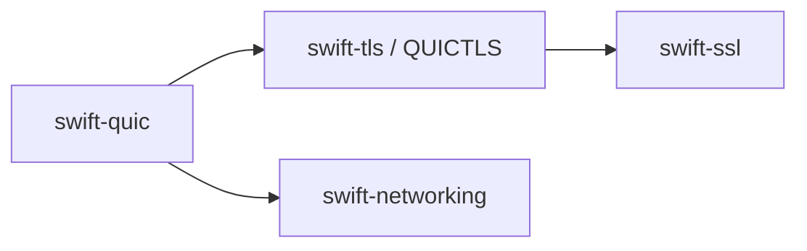

# swift-quic development contract

Read `README.md`, `CONTEXT.md`, and
`../docs/NETWORKING_ARCHITECTURE.md` before changing the package graph or public
API.

## Invariants

- Keep QUIC protocol ownership in the seven products declared by
  `Package.swift`; do not restore removed legacy modules or compatibility
  products.
- Keep engines value-typed, caller-locked, and sans-I/O.
- Use `NetworkingCore.OwnedBytes` for async ownership and scoped `Span` borrows
  for synchronous parsing. Never retain a pointer or span across `await`.
- Use the same `Synchronization.Mutex` state contract on Native, WASM, and
  Embedded. Platform conditionals may select APIs, not weaken isolation.
- Perform socket I/O, timer suspension, TLS capability callbacks, and event
  delivery outside mutex critical sections.
- Preserve typed errors and fail closed. Do not map malformed input, missing
  capability, or authentication failure to a default success.
- `swift-quic` owns CRYPTO offsets/reassembly. `swift-tls` owns the QUIC TLS
  session. `swift-ssl` owns TLS and cryptographic mechanisms.
- The SwiftNIO UDP implementation belongs to `swift-nio-udp`; this package
  depends only on the shared datagram contract.

## Verification

- Compile affected targets with warnings as errors.
- Run the package Xcode test scheme serially with a timeout.
- Run the opt-in WASM validation executable on normal and Embedded WASM using
  the pinned matching Swift 6.4 snapshot and SDK. A module-only build is not
  sufficient evidence for link or runtime behavior.
- Performance claims require the opt-in `QUICBenchmarks` target and measured
  results; benchmark tests do not belong to the normal test suite.
