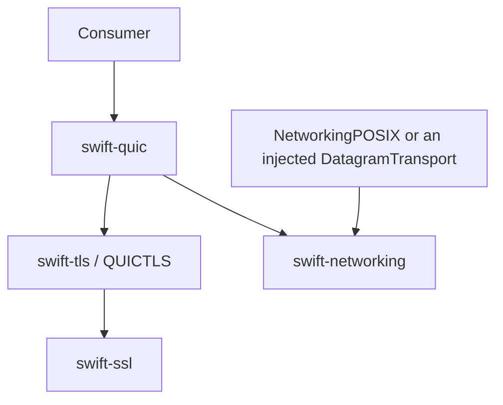

# swift-quic — CONTEXT

Scope: Pure Swift QUIC wire, protection composition, recovery, streams,
connection engine, and datagram/time driver used by libp2p and other QUIC
consumers.

Last reviewed: 2026-08-14

## Dependency and responsibility boundary

- `swift-quic` owns CRYPTO offsets/reassembly, transport parameters,
  packet/header protection composition, packet-number spaces, recovery,
  congestion control, stream state, connection IDs, path validation, and QUIC
  datagrams.
- `swift-tls/QUICTLS` owns session lifecycle and capability suspension.
- `swift-ssl` owns TLS transcript, key schedule, authentication, PKI, and
  cryptographic mechanisms.
- `swift-networking` owns bytes, endpoints, datagram lifecycle, time
  capabilities, and TLS vocabulary. Platform packages own sockets.
- There is no legacy `QUICCore`/`QUICCrypto`/`ManagedConnection`/
  `QUICEndpoint` backend or fallback path.

## Module model

| Module | Responsibility |
|---|---|
| `QUICWire` | Strict varint, frame, and packet wire semantics |
| `QUICPacketProtectionCore` | Closed-suite packet/header protection composition |
| `QUICRecoveryCore` | RTT, ACK/loss, PTO, pacing, NewReno, CUBIC |
| `QUICStreamCore` | Send/receive stream FSM, reassembly, flow control |
| `QUICConnectionCore` | Transport parameters, packet parsing, path values |
| `QUICConnectionEngineCore` | Caller-locked, sans-I/O connection state machine |
| `QUIC` | `QUICClient`, `QUICServerConnection`, and injected I/O/time driver |

These are responsibility modules, not host/portable duplicates. The same core
source is compiled for Native, WASM, and Embedded.

## Ownership and concurrency

- `DatagramTransport.receive()` returns `OwnedBytes`. The driver borrows its
  span only for the synchronous engine transition.
- Engine-produced final `[UInt8]` packet storage is consumed by `OwnedBytes`
  before async send; no additional payload-sized driver copy is permitted.
- `QUICConnectionEngine` is a value type with no I/O and no lock.
- Public drivers protect engine and event state with
  `Synchronization.Mutex` on every target. They release locks before I/O,
  timer suspension, capability callbacks, or event delivery.
- Only one driver run is allowed. Cancellation, clean transport close, timer
  failure, transport failure, engine failure, and TLS failure remain distinct.

## Protocol invariants

- Peer CertificateVerify is fail-closed; Finished never establishes an
  unauthenticated connection.
- ACK processing is bounded by locally known sent packets and capped ranges.
- Flow-control and final-size violations are connection-fatal.
- Packet-number and network integer conversion is checked before narrowing.
- Anti-amplification applies before server address validation.
- Peer transport parameters are cross-checked against observed connection IDs.
- TLS-selected packet-protection suites and secrets are installed at their
  stated encryption level; no hard-coded suite fallback is allowed.
- Per-packet authentication failure may be dropped only where RFC 9001 permits;
  fatal protocol failure is retained and surfaced.

## Portable build contract

- `SWIFT_NETWORKING_WASM=1` selects the normal WASM validation lane.
- `SWIFT_NETWORKING_EMBEDDED=1` enables the Embedded feature and WMO.
- `SWIFT_QUIC_ENABLE_WASM_VALIDATION=1` exposes the opt-in validation
  executable. It links the public facade and runs wire, transport-parameter,
  Initial-key-derivation, and typed-error probes.
- The toolchain and SDK are pinned together to
  `swift-6.4.x-DEVELOPMENT-SNAPSHOT-2026-07-23-a`.
- Standard and Embedded WASM must compile, link, and run the validation
  executable before release.
- The 102-test native suite and the same suite under Address Sanitizer pass on
  the pinned toolchain. On that snapshot, Thread
  Sanitizer cannot compile `swift-ssl`'s ARM64 NEON intrinsics because the Swift
  compiler aborts in LLVM verification; this is a toolchain limitation, not a
  completed race-safety proof.
