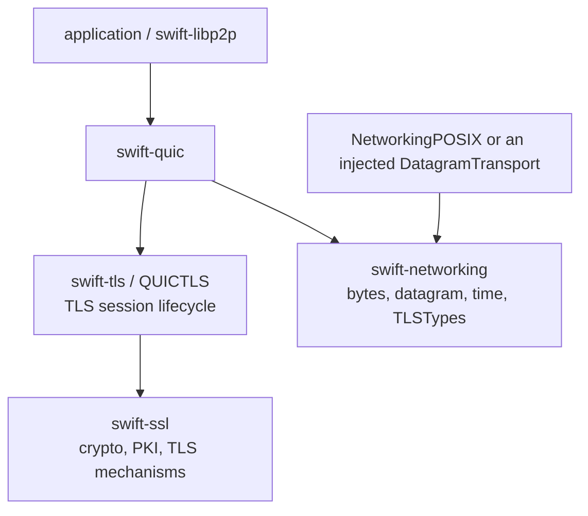
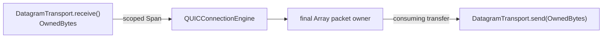

# swift-quic

Pure Swift QUIC transport for Native, WASM, and Embedded Swift. The package
owns QUIC wire semantics, packet protection composition, recovery, streams,
connection state, and the driver that binds the sans-I/O engine to injected
datagram and timer capabilities.

## Responsibility boundary



`swift-quic` owns CRYPTO offsets and reassembly, transport parameters, packet
numbers, frames, header and packet protection orchestration, loss recovery,
congestion control, stream flow control, and connection-ID state. It does not
own TLS transcripts, certificate policy, UDP sockets, NIO, DNS, or application
protocol semantics.

## Products

| Product | Responsibility |
|---|---|
| `QUIC` | `QUICClient`, `QUICServerConnection`, and `QUICEngineConnection` over injected `DatagramTransport` and `AsyncTimer` |
| `QUICWire` | QUIC varints, packets, frames, and strict wire errors |
| `QUICPacketProtectionCore` | RFC 9001 packet/header protection composition |
| `QUICRecoveryCore` | RTT, loss detection, pacing, NewReno, and CUBIC state |
| `QUICStreamCore` | Send/receive stream state, reassembly, and flow control |
| `QUICConnectionCore` | Transport parameters, path validation, packet parsing, and connection values |
| `QUICConnectionEngineCore` | Caller-locked, sans-I/O connection state machine |

The split is by responsibility, not by platform. Native, WASM, and Embedded
compile the same engine and synchronization contract.

## Ownership and I/O



- A received payload is borrowed synchronously and no pointer crosses `await`.
- Final outbound array storage is consumed by `OwnedBytes`; the QUIC driver does
  not make another payload-sized copy.
- The engine is a value type. Public drivers protect it with the same
  `Synchronization.Mutex` contract on every target and perform I/O outside the
  critical section.
- Transport cancellation, clean close, backend failure, queue overflow, and
  timer failure remain distinct typed outcomes.

## Dependencies

- `swift-networking`: `NetworkingCore`, `NetworkingDatagram`,
  `NetworkingTime`, and `TLSTypes`
- `swift-tls`: `QUICTLS` session orchestration
- `swift-ssl`: Pure Swift TLS/PKI/cryptographic mechanisms

There is no dependency on `swift-p2p-core`, `swift-p2p-transport`, BoringSSL,
or SwiftNIO. Applications choose a datagram adapter separately.

## Installation

```swift
dependencies: [
    .package(url: "https://github.com/1amageek/swift-quic.git", from: "2.0.0"),
]
```

## Verification

Normal correctness tests are separate from opt-in benchmarks:

```bash
scripts/swift-test-timeout.sh 120 env \
  TOOLCHAINS=org.swift.64202607231a \
  xcodebuild test \
  -scheme swift-quic-Package \
  -destination 'platform=macOS' \
  -parallel-testing-enabled NO \
  "LD_RUNPATH_SEARCH_PATHS=\$(inherited) $HOME/Library/Developer/Toolchains/swift-6.4.x-DEVELOPMENT-SNAPSHOT-2026-07-23-a.xctoolchain/usr/lib/swift/macosx/testing"

SWIFT_QUIC_ENABLE_BENCHMARKS=1 \
TOOLCHAINS=org.swift.64202607231a \
swift run -c release -debug-info-format none quic-benchmarks
```

Portable builds use the pinned matching Swift 6.4 snapshot and SDK:

```bash
SWIFT_NETWORKING_WASM=1 SWIFT_QUIC_ENABLE_WASM_VALIDATION=1 \
swift run --swift-sdk swift-6.4.x-DEVELOPMENT-SNAPSHOT-2026-07-23-a_wasm \
  -c release quic-wasm-validation

SWIFT_NETWORKING_EMBEDDED=1 SWIFT_QUIC_ENABLE_WASM_VALIDATION=1 \
swift run --swift-sdk swift-6.4.x-DEVELOPMENT-SNAPSHOT-2026-07-23-a_wasm-embedded \
  -c release quic-wasm-validation
```

The benchmark and WASM validation executables are opt-in and are not part of
the normal product or test graph.

Release verification on 2026-08-14 passed 102 native tests, the same 102 tests
under Address Sanitizer, and the standard and Embedded WASM validation
executables through compile, link, and runtime.

### Current benchmark

Measured on 2026-08-14 with an Apple M4 Max (14 cores), Swift
`ef761e567dc94ee`, and the Release configuration. The table reports the median
of five consecutive executions of the same built executable.

| Byte path | Median throughput |
|---|---:|
| QUIC varint encode/decode round-trip | 15.55 M operations/s |
| STREAM frame 1,200-byte encode/decode round-trip | 3.48 M operations/s |
| Borrowed coalesced datagram split, 1,200 bytes | 17.56 M operations/s |
| AES-128-GCM seal/open round-trip, 1,200 bytes | 0.69 M operations/s |
| Connection ID dictionary lookup | 20.16 M operations/s |

These measurements are regression baselines for the current Swift byte paths;
they are not cross-library comparisons.
